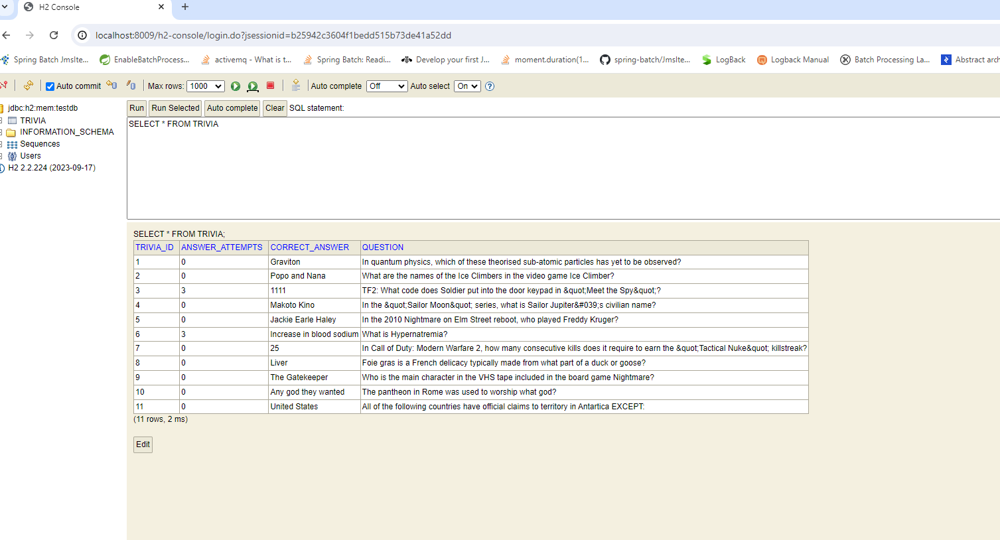

# Trivia Game Solution

This project implements a Trivia Game with a REST API that provides endpoints for starting a trivia game and replying to a trivia question. The project is built using Spring Boot and includes unit tests, integration tests, and uses an H2 in-memory database for data storage.

## Table of Contents

- [Features](#features)
- [Project Structure](#project-structure)
- [Endpoints](#endpoints)
- [Database](#database)
- [Running the Application](#running-the-application)
- [Testing](#testing)
- [Internals](#internals)
- [Conclusion](#conclusion)

## Features

- **Start New Trivia Game**: Allows users to start a new trivia game by fetching a question from a third-party trivia API.
- **Submit Answers**: Users can submit their answers to trivia questions and get immediate feedback on whether their answer is correct.
- **Track Attempts**: The service tracks the number of attempts made by the user for each trivia question. After three incorrect attempts, further attempts are blocked.
- **Dynamic Questions**: Trivia questions are dynamically fetched from an external API, providing a wide variety of questions.
- **Persistence**: Uses an H2 in-memory database to store trivia questions and user attempts, ensuring data is managed effectively during the session.

## Project Structure

The project follows a typical Spring Boot structure:

trivia-game/
│
├── src/main/java/exercise/santander/solution/
│ ├── config/ # Configuration classes
│ ├── domain/ # Domain classes
│ ├── entity/ # JPA entities
│ ├── exception/ # Exception handling
│ ├── repository/ # Repositories
│ ├── service/ # Service layer
│ ├── resource/ # Controller layer
│ └── SantanderTechnicalSolution.java# Main application class
│
├── src/test/java/exercise/santander/solution/
│ ├── service/ # Service layer tests
│ ├── resource/ # Controller layer tests
│ ├── exception/ # Exception handling tests
│ ├── repository/ # Repository layer tests
│ └── SantanderTechnicalSolutionTest.java # Test class for TriviaService
│
├── src/main/resources/
│ ├── application.properties # Application properties
│ └── data.sql # Initial data for H2 database
│
├── README.md # Project README file
└── pom.xml # Maven POM file

## Endpoints

The API provides the following endpoints:

### POST /trivia/start

Starts a new trivia game by fetching a question from a third-party API.


#### Request
```http
POST /trivia/start
 ```

### Response
```json
{
  "triviaId": 1,
  "possibleAnswers": [
    "Answer 1",
    "Answer 2",
    "Answer 3",
    "Correct Answer"
  ]
}

```


```http
PUT /trivia/reply/{triviaId}
```
### Response

```json
{
  "answer": "Your Answer"
}


```

### Database




